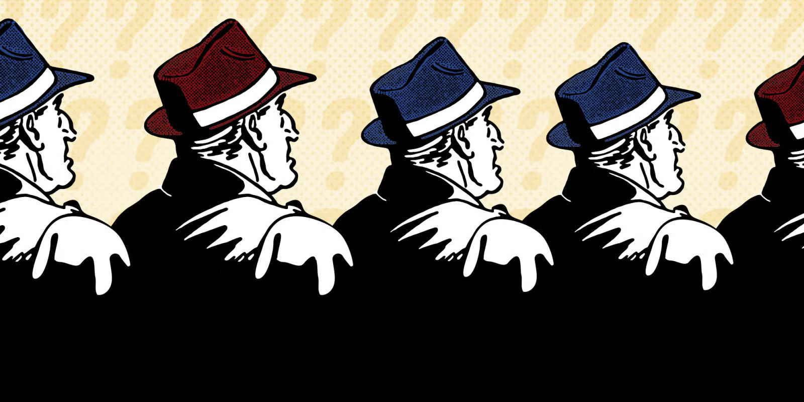

# 🔴🔵 100 Prisoners with Red/Blue Hats

A classic logic puzzle solved using **parity** in Python.

## The Puzzle

One hundred prisoners are lined up single file. A blue or red hat is placed on each of their heads randomly. The prisoners cannot see the color of the hat on their own head, but they can see the colors of all the hats in front of them. The prisoner in the back can clearly see all 99 hats in front of him. 

The 50th prisoner in line can see the 49 hats in front of him, and the prisoner in the front of the line cannot see anything but the forest before him. Also, the prisoners don't know the proportion of red hats to blue hats in advance—it could be 50/50, but it could also be any combination that adds to 100.

A guard is going to walk down the line, starting in the back, and ask each prisoner what color hat they have on. They can only answer "blue" or "red." If they answer incorrectly, or say anything else, they will be shot dead on the spot. If they answer correctly, they will be set free. Each prisoner can hear all of the other prisoners' responses, as well as any gunshots that indicate an incorrect response. They can remember all of this information.

Before the executions begin, the prisoners get to huddle up and make a plan. How can the prisoners ensure that the most people possible survive? 

> Red

or

> Blue

If they correctly identify their own hat, they survive.

The prisoners are allowed to discuss a strategy before the process begins.



### Goal

Find a strategy that guarantees the survival of as many prisoners as possible.

---

## The Strategy
Solution: 

A maximum of 99 prisoners can be guaranteed to survive by using a parity-based strategy.

Step 1: Signal by the Last Prisoner (100th)

    The last prisoner counts the number of red hats in front.
    If the count is even, he says “Red”.
    If the count is odd, he says “Black”. 

This announcement encodes the parity (even/odd) of red hats.
His own survival is uncertain (50% chance), as he is only passing information.

Step 2: Information Available to Others

Each subsequent prisoner has access to:

    The initial parity signal
    The answers have already been spoken
    The hats visible in front

Step 3: Deduction Process

    Each prisoner uses the expected parity given by the first prisoner.
    Each prisoner counts the number of red hats visible ahead and the number of red hats confirmed from previous answers.
    Each prisoner compares the observed parity with the expected parity.
    If both match, the prisoner concludes their hat is black.
    If they do not match, the prisoner concludes their hat is red. 

Result

    The first prisoner may be incorrect.
    The remaining 99 prisoners are guaranteed to be correct.

---

## Example

Hats (back to front): `Blue, Red, Red, Blue, Red`

- Back prisoner sees 3 red hats (odd) → says **Blue** (signal: odd).
- Prisoner 2 sees 2 reds ahead, 0 announced → parity needs to be odd, 2 is even → own hat is **Red** ✅
- Prisoner 3 sees 1 red ahead, 1 announced → total 2 (even), needs odd → own hat is **Red** ✅
- Prisoner 4 sees 1 red ahead, 2 announced → total 3 (odd), matches → own hat is **Blue** ✅
- Prisoner 5 sees 0 ahead, 2 announced → total 2 (even), needs odd → own hat is **Red** ✅

---

## Project Structure

```text
.
├── solutions.ipynb   # Strategy, simulation, and verification
└── README.md
```

## Key Idea

Parity (even/odd) compresses the one bit of information the back prisoner can safely sacrifice, letting everyone else reconstruct their own hat exactly.

## References:

learn more about this puzzle : https://www.popularmechanics.com/science/math/a25254/riddle-of-the-week-16/ </br>
youtube video for explanation : https://www.youtube.com/watch?v=RtidKw-qDxY </br>
Image soruce same as : https://www.popularmechanics.com/science/math/a25254/riddle-of-the-week-16/
