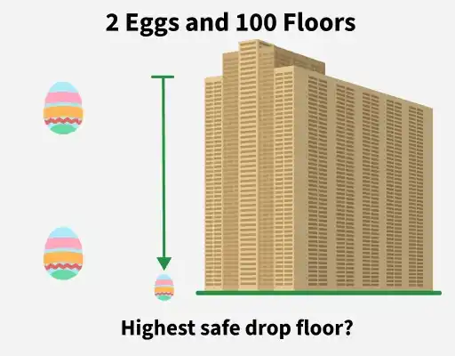

# 🥚 2 Eggs and 100 Floors

A classic **logic and optimization puzzle** implemented in Python.

The goal is to determine the **highest floor from which an egg can be dropped without breaking**, while minimizing the number of drops in the worst case.

---

## The Puzzle

You have:

* 🏢 **100 floors**
* 🥚 **2 identical eggs**
* One unknown **breaking floor**



The rules are:

1. An egg can be dropped from any floor.
2. If the egg **survives**, you can use it again.
3. If the egg **breaks**, it cannot be used again.
4. You must determine the exact breaking floor.
5. The objective is to minimize the **maximum number of drops** required.

### Example

Suppose the breaking floor is **73**.

```text
Floor 72 → Egg survives
Floor 73 → Egg breaks
```

The answer is therefore **73**.

---

## The Strategy

A simple approach would be to test every floor one by one:

```text
1 → 2 → 3 → 4 → ... → 100
```

But in the worst case, this could require **100 drops**.

With only two eggs, we can do better by using **decreasing intervals**.

For 100 floors, start with:

```text
14
```

Then increase the floor by decreasing amounts:

```text
14
14 + 13 = 27
27 + 12 = 39
39 + 11 = 50
50 + 10 = 60
60 + 9  = 69
69 + 8  = 77
...
```

The reason this works is:

```text
14 + 13 + 12 + 11 + ... + 1 = 105
```

Since:

```text
105 ≥ 100
```

we can cover all 100 floors.

Therefore, **14 drops are sufficient in the worst case**.

---

## Why Decreasing Intervals?

Suppose the first egg breaks after dropping from floor 39.

We know the breaking floor must be somewhere between:

```text
28 and 39
```

We now use the second egg to test those floors **one by one**.

The number of remaining floors is balanced against the number of drops already used.

For example:

```text
First drop  → 14
Second      → 27
Third       → 39
```

If the egg breaks at 39, the second egg can check:

```text
28
29
30
...
39
```

This keeps the worst-case number of drops at **14**.

---

## Example Strategy for 100 Floors

| Drop | Floor |
| ---- | ----: |
| 1    |    14 |
| 2    |    27 |
| 3    |    39 |
| 4    |    50 |
| 5    |    60 |
| 6    |    69 |
| 7    |    77 |
| 8    |    84 |
| 9    |    90 |
| 10   |    95 |
| 11   |    99 |
| 12   |   100 |

The actual number of drops depends on where the egg breaks.

The strategy guarantees that the answer can be found within **14 drops**.

---


Enter the number of floors:

```text
Enter number of floors: 100
```

Output:

```text
Minimum worst-case drops: 14

First egg strategy:

Drop egg from floor: 14
Drop egg from floor: 27
Drop egg from floor: 39
Drop egg from floor: 50
Drop egg from floor: 60
Drop egg from floor: 69
Drop egg from floor: 77
Drop egg from floor: 84
Drop egg from floor: 90
Drop egg from floor: 95
Drop egg from floor: 99
Drop egg from floor: 100
```

---

## 🔢 Try Different Numbers

The program is not limited to 100 floors.

Try:

```text
10
20
50
100
500
1000
```

For example:

```text
Enter number of floors: 50
```

The program calculates the required number of drops automatically.

---

## 📐 The Mathematics

We need the smallest number `n` such that:

```text
n + (n - 1) + (n - 2) + ... + 1 >= floors
```

This can also be written as:

```text
n(n + 1) / 2 >= floors
```

For 100 floors:

```text
14 × 15 / 2 = 105
```

Therefore:

```text
105 >= 100
```

So the minimum worst-case number of drops is:

```text
14
```

---

## Key Concept

This puzzle demonstrates an important idea in **algorithm design**:

> Instead of trying to minimize the number of drops in the average case, balance the possible worst-case outcomes.

The decreasing-step strategy makes sure that if the first egg breaks at any point, there are enough remaining attempts with the second egg to search the floors below it.

---

## Concepts Used

* Algorithms
* Mathematical optimization
* Worst-case analysis
* Greedy strategy
* Problem solving
* Python loops
* User input

---

## Note

This implementation focuses on the **mathematical strategy** behind the classic 2-egg problem rather than simulating physical egg drops.

The goal is to understand **why 14 drops are sufficient for 100 floors** and how the decreasing-gap strategy works.

## Detailed Explanation
https://www.geeksforgeeks.org/aptitude/puzzle-set-35-2-eggs-and-100-floors/ </br>
Image source from: GeeksforGeeks