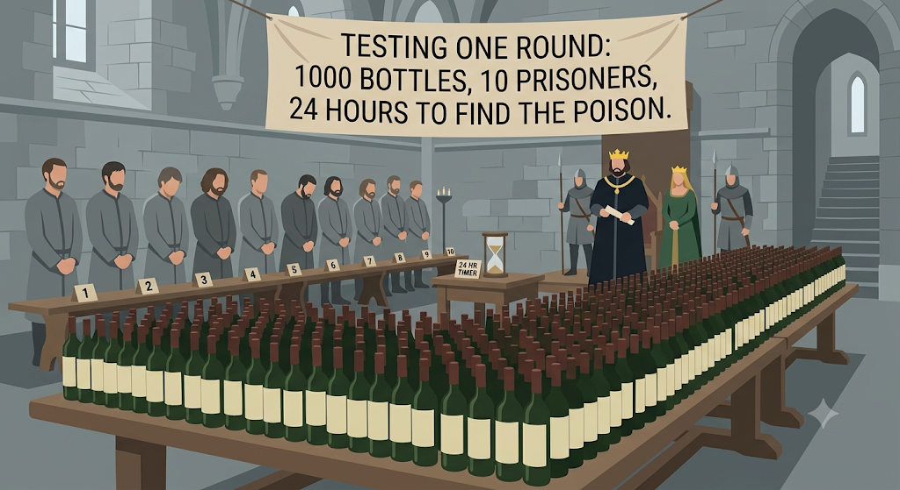

# 1000 Bottles of Wine, 10 Prisoners and a Drop of Poison

A classic math/logic puzzle solved in Python using **binary numbers** and **bitwise operations**.

## Table of Contents

- [The Puzzle](#the-puzzle)
- [The Key Idea](#the-key-idea)
- [Step-by-Step Solution](#step-by-step-solution)
- [Worked Examples](#worked-examples)
- [Why It Works](#why-it-works)
- [How the Program Works](#how-the-program-works)
- [Getting Started](#getting-started)
- [Sample Output](#sample-output)
- [How Many Prisoners Do You Need?](#how-many-prisoners-do-you-need)
- [Credit](#credit)

## The Puzzle

A King in a small country hosts an annual party for his 1000 senators. By tradition, every senator brings him one bottle of wine.

Shortly afterwards, the Queen learns that one senator is plotting to assassinate the King with a poisoned bottle. Nobody knows which senator is behind it or which bottle is poisoned, and the poison cannot be detected by taste, smell or sight.

The King has 10 prisoners who are due to be executed, and he decides to use them as taste testers. The poison has no effect at first. Exactly 24 hours after drinking it, the prisoner suddenly dies.

The festivities must go on tomorrow, so the King has time for **only one round of testing**.




**Question:** How can the King give the wine to the prisoners so that, 24 hours from now, he is guaranteed to know which bottle is poisoned?

## The Key Idea

Each prisoner has **two possible outcomes**: dead or alive.

With 10 prisoners, the number of possible outcome patterns is:

```
2 x 2 x 2 x 2 x 2 x 2 x 2 x 2 x 2 x 2 = 2^10 = 1024
```

1024 is greater than 1000, so every bottle can be given its own unique pattern. That pattern is simply the bottle's number written in **binary**.

## Step-by-Step Solution

**Step 1: Number the bottles.**
Label the bottles `0` to `999`.

**Step 2: Number the prisoners.**
Label the prisoners `0` to `9`. Each prisoner stands for one binary digit (bit):

| Prisoner | 0 | 1 | 2 | 3 | 4  | 5  | 6  | 7   | 8   | 9   |
|----------|---|---|---|---|----|----|----|-----|-----|-----|
| Value    | 1 | 2 | 4 | 8 | 16 | 32 | 64 | 128 | 256 | 512 |

Prisoner `n` is worth `2^n`.

**Step 3: Decide who drinks from each bottle.**
Write the bottle's number as a sum of these values. Every prisoner whose value is part of the sum drinks from that bottle.

**Step 4: Everyone drinks, then wait 24 hours.**
Give each prisoner a small sip from every bottle assigned to them.

**Step 5: See who died.**
Only the prisoners who drank from the poisoned bottle die.

**Step 6: Add up the values of the dead prisoners.**
The total is the number of the poisoned bottle.

## Worked Examples

| Bottle | Binary       | Prisoners who drink it      |
|--------|--------------|-----------------------------|
| 0      | `0000000000` | none                        |
| 1      | `0000000001` | 0                           |
| 5      | `0000000101` | 0, 2                        |
| 10     | `0000001010` | 1, 3                        |
| 341    | `0101010101` | 0, 2, 4, 6, 8               |
| 999    | `1111100111` | 0, 1, 2, 5, 6, 7, 8, 9      |

**Example:** suppose prisoners 0, 2, 4, 6 and 8 die.

```
1 + 4 + 16 + 64 + 256 = 341
```

The poisoned bottle is **#341**.

## Why It Works

- Every bottle number has a **different** binary representation, so no two bottles are given to the same group of prisoners.
- Only the prisoners who drank the poisoned bottle die, so the group of dead prisoners identifies exactly one bottle.
- Adding up the values of the dead prisoners converts that group back into the bottle number.

## How the Program Works

The program has two small functions plus a test and an example run.

| Part              | What it does                                                                                           |
|-------------------|--------------------------------------------------------------------------------------------------------|
| `bottles`, `prisoners` | Settings: 1000 bottles and 10 prisoners.                                                          |
| `test_bottle()`   | For a given bottle, checks each prisoner's bit with a bitwise AND and returns the prisoners who drink from it. If that bottle is poisoned, these are the prisoners who die. |
| `find_bottle()`   | Adds `2 ** prisoner` for every dead prisoner to rebuild the bottle number.                             |
| Test loop         | Runs the full process for all 1000 bottles and uses `assert` to confirm the answer always matches.     |
| Example run       | Picks a random poisoned bottle, finds the dead prisoners, and prints the decoded result.               |

### Concepts used

- **Binary numbers:** every whole number can be written using only 0s and 1s.
- **Bitwise AND (`&`) and left shift (`<<`):** a quick way to check whether a particular bit of a number is 1.
- **Powers of two:** each prisoner's bit is worth `2 ** prisoner`.
- **`assert`:** stops the program with an error if the decoded bottle is ever wrong.

## Getting Started

### Requirements

- Python 3.6 or newer
- No external libraries (only the built-in `random` module)

### Run it

I'm using jupyter notebook (.ipynb file) for step by step execution of the code . 

Run each block of code.

If nothing fails during the test loop, the method works for every bottle from 0 to 999.

## Sample Output

The poisoned bottle is random, so your numbers will differ:

```
Poisoned bottle: 341
Dead prisoners: [0, 2, 4, 6, 8]
Found bottle: 341
```

## How Many Prisoners Do You Need?

For `N` bottles you need `ceil(log2(N))` prisoners.

| Bottles | Prisoners needed |
|---------|------------------|
| 8       | 3                |
| 100     | 7                |
| 1000    | 10               |
| 1024    | 10               |
| 1025    | 11               |

To try a different number of bottles, change the `bottles` and `prisoners` settings at the top of the program.

## Credit

Puzzle explained by Brett Berry in
[A King, 1000 Bottles of Wine, 10 Prisoners and a Drop of Poison](https://medium.com/i-math/a-king-1000-bottles-of-wine-10-prisoners-and-a-drop-of-poison-2dd1959a8dd2) (Math Hacks on Medium).
Image for 1000 Bottles of Wine Riddle: *Image generated with AI via Gemini*