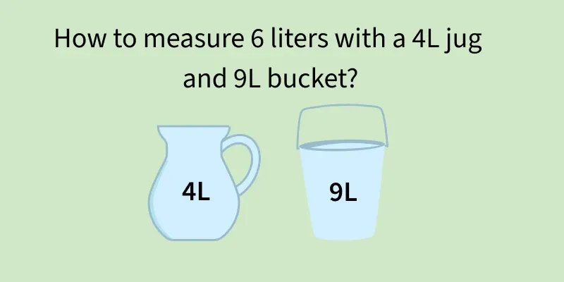

# Water Jug Problem using (BFS)

A Python notebook that solves the classic water jug problem using Breadth-First Search (BFS). Given a 9L bucket and a 4L jug, it finds the shortest sequence of steps to measure exactly 6 liters in the 9L bucket.

## Problem Statement

You have two containers with no measuring marks:

- A **9-liter bucket**
- A **4-liter jug**

You can fill, empty, or pour water between them. The goal is to end up with exactly **6 liters** in the 9L bucket.



## How It Works

Each state is a tuple `(bucket, jug)` representing the current water level in each container. BFS explores states level by level, so the first time it reaches the goal, the path is guaranteed to be the shortest.

At each state, six moves are possible:

| Move | Description |
|------|-------------|
| Fill 9L bucket | Fill the bucket to capacity |
| Fill 4L jug | Fill the jug to capacity |
| Empty 9L bucket | Pour out the bucket completely |
| Empty 4L jug | Pour out the jug completely |
| Pour 9L -> 4L | Pour from bucket into jug until the jug is full or the bucket is empty |
| Pour 4L -> 9L | Pour from jug into bucket until the bucket is full or the jug is empty |

A `visited` set prevents revisiting states, and each queue entry stores the list of steps taken so far, so the solution path can be printed at the end.

## Notebook Structure

| Cell | Purpose |
|------|---------|
| 1 | Imports, capacities, target, and BFS initialization (queue and visited set) |
| 2 | `get_next_states(bucket, jug)` successor function |
| 3 | Runs the BFS loop and stores the solution |
| 4 | Prints the step-by-step result |

## Requirements

- Python 3.8+
- Jupyter Notebook, JupyterLab, or VS Code with the Jupyter extension

Only the standard library is used (`collections.deque`), so there is nothing extra to install.

## Usage

1. Open the notebook in Jupyter.
2. Run the cells in order, from Cell 1 to Cell 4.
3. To re-run the search, run Cell 1 again first. The queue and visited set are modified during the search and must be reset.

## Customizing the Problem

Change these variables in Cell 1:

```python
capacity_9 = 9   # capacity of the larger container
capacity_4 = 4   # capacity of the smaller container
target = 6       # amount to measure in the larger container
```

Note that not every target is solvable. A target is reachable only if it is a multiple of the GCD of the two capacities and does not exceed the larger capacity. If no solution exists, the notebook prints `No solution found.`

## Example Output

```
Solution found:

1. Fill 9L bucket
2. Pour 9L -> 4L
3. Empty 4L jug
4. Pour 9L -> 4L
5. Empty 4L jug
6. Pour 9L -> 4L
7. Fill 9L bucket
8. Pour 9L -> 4L

Final state: (6, 4)
```

Run the notebook to see the exact shortest sequence for your inputs.

## Complexity

With capacities `A` and `B`, there are at most `(A + 1) * (B + 1)` distinct states, so BFS runs in `O(A * B)` time and space.

## For Detailed Explanation

https://www.geeksforgeeks.org/aptitude/measuring-6l-water-4l-9l-buckets/