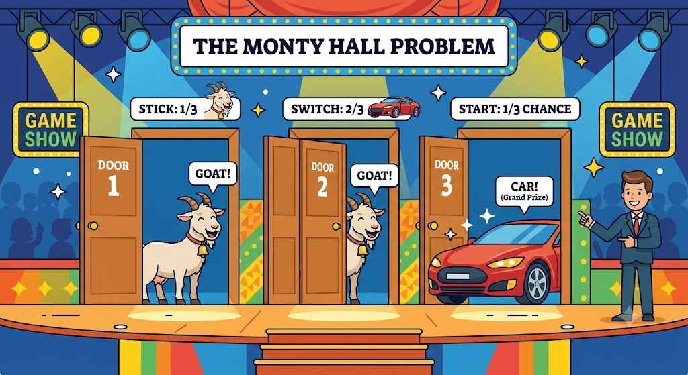

# Monty Hall Problem

A famous probability puzzle where **your first choice is not as safe as it looks.**

This project uses a Python simulation to show that **switching doors wins about twice as often as staying**.

## Table of Contents

- [The Problem](#-the-problem)
- [The Surprising Answer](#-the-surprising-answer)
- [Why Switching Works](#-why-switching-works)
- [The 100-Door Intuition](#-the-100-door-intuition)
- [Python Simulation](#-python-simulation)
- [Getting Started](#-getting-started)
- [Expected Results](#-expected-results)
- [Key Takeaways](#-key-takeaways)

## The Problem

You're on a game show with **3 doors**.

- Behind one door is a 🚗 **car**.
- Behind the other two are 🐐 **goats**.



The rules:

1. You pick one door.
2. The host, who **knows where the car is**, opens one of the other two doors and **always reveals a goat**.
3. You are offered a choice:

> **Do you stay with your original door, or switch to the other unopened door?**

Two doors remain, so it feels like a **50-50** choice and switching shouldn't matter.

**It does matter.**

## The Surprising Answer

| Strategy  | Win Probability |
| --------- | --------------- |
| 🚪 Stay   | 1/3 (~33.3%)    |
| 🔄 Switch | 2/3 (~66.7%)    |

Switching **doubles** your chances of winning the car.

## Why Switching Works

Your first pick has only a **1/3 chance** of being the car, so there is a **2/3 chance** the car is behind one of the other two doors.

The host never opens the car door and never opens your door. When he reveals a goat, the entire **2/3 probability** collapses onto the one remaining unopened door.

```text
              Initial Choice
                   │
            ┌──────┴──────┐
            │             │
          1/3            2/3
        Your Door     Other Doors
                          │
                    Host removes
                      one goat
                          │
                          ▼
                    Remaining Door
                         2/3
```

### Every possible case

Say you always pick **Door 1**. There are only three equally likely situations:

| Car is behind | Host opens        | If you stay | If you switch |
| ------------- | ----------------- | ----------- | ------------- |
| Door 1        | Door 2 or Door 3  | ✅ Win      | ❌ Lose       |
| Door 2        | Door 3 (forced)   | ❌ Lose     | ✅ Win        |
| Door 3        | Door 2 (forced)   | ❌ Lose     | ✅ Win        |

- **Stay** wins in 1 of 3 cases.
- **Switch** wins in 2 of 3 cases.

The key detail is the word *forced*. When your first pick is wrong, the host has no choice about which door to open, and that is what gives you the extra information.

## The 100-Door Intuition

If the 3-door version still feels strange, scale it up.

- There are **100 doors**, with one car.
- You pick Door 1. Your chance of being right is **1 in 100**.
- The host, who knows where the car is, opens **98 other doors**, all goats.
- Two doors remain: yours and one other.

Would you stay with your 1-in-100 guess, or switch to the door the host carefully left closed? Switching wins **99%** of the time. The 3-door game is the same idea at a smaller scale.

## Python Simulation

Instead of only trusting the math, this project **plays the game 10,000 times** and compares both strategies:

1. Randomly place the car behind one of 3 doors.
2. Randomly choose a door for the player.
3. Let the host open a goat door that is neither the player's door nor the car's door.
4. Record whether **staying** would win and whether **switching** would win.
5. Repeat 10,000 times and calculate the win rates.

## Getting Started

### Requirements

- Python 3.6 or newer
- No external libraries (only the built-in `random` module)

### Project structure

```text
monty-hall-problem-stay-or-switch/
├── solution.ipynb   # the simulation
└── README.md       # this file
```

### Run it

Run each block of code in notebook

## Expected Results

Results change slightly on every run because the doors and choices are random, but they should be close to:

```text
Stay   → ~33%
Switch → ~67%
```

The more games you simulate, the closer the results get to exactly 1/3 and 2/3. This is the **law of large numbers** in action.

## Key Takeaways

- **Simulation can test intuition.** When a probability answer feels wrong, running the experiment is a fast way to check it.
- **Information changes probabilities.** The host's action is not random. He knows where the car is, and that knowledge is why switching helps.
- **Start from the first choice.** The answer isn't about the final two doors looking equal. It's about what happened *before* the choice was reduced to two doors.
- **The rules matter.** If the host opened a door at random and just happened to reveal a goat, the odds would be 50-50. The host *always* avoiding the car is what makes switching better.

## Further Reading

- [Monty Hall problem on Wikipedia](https://en.wikipedia.org/wiki/Monty_Hall_problem)
-  Image is generated using Google Gemini
