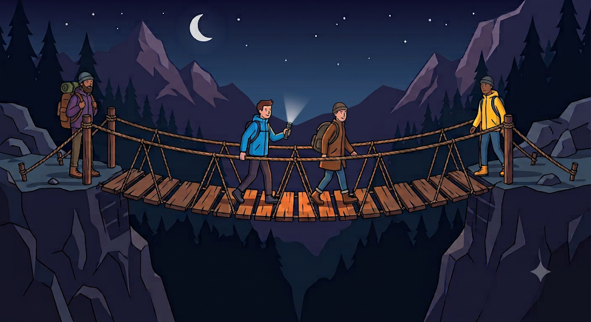

# Bridge and Torch Puzzle

A classic **logic and optimization puzzle** implemented in Python.

The goal is to get everyone across a bridge in the **minimum total time**, using only one torch.

---

## The Puzzle

Four people need to cross a bridge at night:

| Person | Time to cross |
| ------ | ------------: |
| A      |         1 min |
| B      |         2 min |
| C      |         7 min |
| D      |        10 min |



The rules are:

1. It is night, and there is only **one torch**.
2. At most **two people** can cross the bridge at a time.
3. Anyone crossing (one or two people) must **carry the torch**.
4. The torch must be **walked back** by someone, it cannot be thrown.
5. When two people cross together, they move at the **slower person's pace**.

The objective is to find the **minimum total time** for all four people to cross.

---

## The Strategy

A tempting approach is to let the fastest person (A) escort everyone:

```text
A + D cross  → 10
A returns    → 1
A + C cross  → 7
A returns    → 1
A + B cross  → 2
Total        → 21 minutes
```

This works, but it is **not optimal**.

A better idea is to **send the two slowest people together**, so their slow times overlap instead of being added separately.

---

## The Optimal Solution

| Step | Direction     | Who moves | Time calculation | Running total |
| ---- | ------------- | --------- | ---------------- | ------------: |
| 1    | Going right   | A and B   | max(1, 2) = 2    |             2 |
| 2    | Coming back   | A         | 1                |             3 |
| 3    | Going right   | C and D   | max(7, 10) = 10  |            13 |
| 4    | Coming back   | B         | 2                |            15 |
| 5    | Going right   | A and B   | max(1, 2) = 2    |            17 |

```text
2 + 1 + 10 + 2 + 2 = 17 minutes
```

The minimum total time is **17 minutes**.

---

## Why This Works

* **Steps 1-2:** The two fastest people cross, and A brings the torch back so B waits on the far side.
* **Step 3:** C and D, the two slowest, cross **together**. This costs only 10 minutes instead of 17 (7 + 10).
* **Step 4:** B, who is already on the far side, returns with the torch. This is cheap because B is fast.
* **Step 5:** A and B cross one last time.

The key idea is to **avoid making the slow people cross separately**, and to use the fast people as torch carriers.

---

# Python code for solution

Run each block of code

## Key Concept

This puzzle demonstrates an important idea in **algorithm design**:

> The obvious greedy choice (always use the fastest person as the escort) is not always the best. Sometimes pairing the slowest people together gives a better overall result.

---

## Concepts Used

* Algorithms
* Optimization
* Greedy strategy and its limits
* Step-by-step simulation
* Python dictionaries
* f-strings and `max()`

---

## Note

This implementation uses a **fixed sequence of steps** for the given times (1, 2, 7, 10). For different times, the best strategy may change, so a more general version would compare the possible strategies and choose the smaller total. </br>

Image source : Google Gemini
