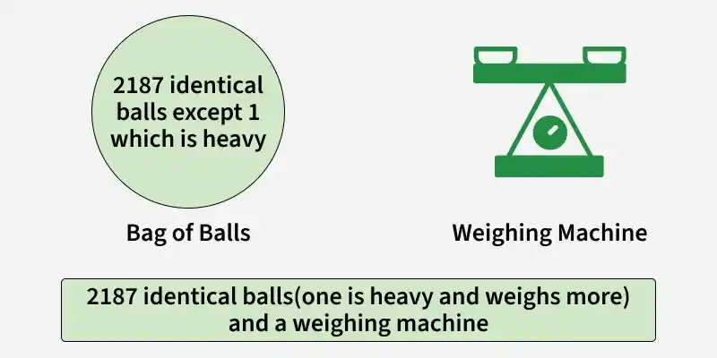

# ⚖️ Heavy Ball Puzzle

There are 2187 identical-looking balls, but exactly one ball is heavier than the rest. You have a two-pan balance scale that can show three outcomes: left heavier, right heavier, or balanced. 


What is the minimum number of weighings needed to guarantee finding the heavy ball? Explain briefly.



> **Answer: 7 weighings** (because 2187 = 3⁷)

---

## Table of Contents

- [The Puzzle](#-the-puzzle)
- [Key Idea](#-key-idea)
- [How the Program Works](#-how-the-program-works)
- [Running the Program](#-running-the-program)
- [Example Session](#-example-session)
- [Solution Walkthrough](#-solution-walkthrough)
- [Why 7 Is the Minimum](#-why-7-is-the-minimum)
- [Notes and Limitations](#-notes-and-limitations)
- [Takeaways](#-takeaways)

---

## The Puzzle

- There are **2187** balls that look identical, numbered **1 to 2187**.
- Exactly **one** ball is heavier; all others weigh the same.
- You have a **two-pan balance scale** with three possible outcomes:

| Outcome | Meaning |
|---------|---------|
| Left pan down | The heavy ball is in the left group |
| Right pan down | The heavy ball is in the right group |
| Balanced | The heavy ball is in the group left off the scale |

**Question:** What is the minimum number of weighings that *guarantees* finding the heavy ball?

---

## Key Idea

Every weighing has **3 outcomes**, so it can split the possibilities into **3 groups**, not 2. Unlike binary search (halving), this is a **ternary search** (thirding).

Split the remaining balls into three equal groups: **Group 1** (left pan), **Group 2** (right pan), and **Group 3** (off the scale). Then weigh Group 1 against Group 2:

- Left heavier → the heavy ball is in **Group 1**
- Right heavier → the heavy ball is in **Group 2**
- Balanced → the heavy ball is in **Group 3**

Either way, the candidates shrink to **one third**.

---

## How the Program Works

The program acts as your assistant while you do the weighing. It keeps track of which balls are still suspects and tells you how to split them. You report what the scale shows, and it narrows the search.

1. **Start** with all 2187 balls as candidates and a weighing counter at 0.
2. **Loop** while more than one candidate remains:
   - Increase the weighing counter.
   - Divide the candidates into three equal groups.
   - Display the weighing number and the size of Group 1 (left pan) and Group 2 (right pan). Group 3 stays off the scale.
   - Ask you for the scale result: `left`, `right`, or `equal`.
   - Keep only the matching group as the new candidates:

     | You enter | Candidates become |
     |-----------|-------------------|
     | `left` | Group 1 |
     | `right` | Group 2 |
     | `equal` | Group 3 |

   - Show how many balls remain.
3. **Finish** when one ball is left, and print the heavy ball's number along with the total number of weighings.

**Input handling:** input is not case-sensitive. If you type anything other than `left`, `right`, or `equal`, the program shows an error message, does **not** count it as a weighing, and asks again.

---

## Running the Program

Run each block of solution.ipynb file (enter right,left or equal)

Think of a secret heavy ball (or have a friend pick one), then answer each prompt based on where that ball falls in the groups.

---

## Example Session

```text
Weighing: 1
Group 1: 729 balls
Group 2: 729 balls
Enter result (left/right/equal): left
Balls remaining: 729

Weighing: 2
Group 1: 243 balls
Group 2: 243 balls
Enter result (left/right/equal): equal
Balls remaining: 243

...

Weighing: 7
Group 1: 1 balls
Group 2: 1 balls
Enter result (left/right/equal): right
Balls remaining: 1

Heavy ball: <ball number>
Total weighings: 7
```

---

## Solution Walkthrough

Since 2187 = 3⁷, each weighing divides the candidates by 3 exactly:

```text
2187 → 729 → 243 → 81 → 27 → 9 → 3 → 1
```

| Weighing | Balls per group | Candidates before | Candidates after |
|:--------:|:---------------:|:-----------------:|:----------------:|
| 1 | 729 | 2187 | 729 |
| 2 | 243 | 729 | 243 |
| 3 | 81 | 243 | 81 |
| 4 | 27 | 81 | 27 |
| 5 | 9 | 27 | 9 |
| 6 | 3 | 9 | 3 |
| 7 | 1 | 3 | 1 |

After **7 weighings**, exactly one candidate remains: the heavy ball.

---

## Why 7 Is the Minimum

- There are **2187 possible answers** (any ball could be the heavy one).
- Each weighing yields at most **3 outcomes**.
- After *k* weighings, you can distinguish at most **3ᵏ** cases.

To tell all 2187 cases apart you need:

```text
3ᵏ ≥ 2187  →  k ≥ log₃(2187) = 7
```

With only 6 weighings you could distinguish at most 3⁶ = 729 cases, which is not enough. So **7 is both sufficient and necessary**.

For other numbers of balls, the minimum is **⌈log₃(n)⌉** weighings:

| Balls (n) | Weighings |
|:---------:|:---------:|
| 3 | 1 |
| 9 | 2 |
| 27 | 3 |
| 81 | 4 |
| 243 | 5 |
| 729 | 6 |
| 2187 | 7 |

---

## Notes and Limitations

- The program splits the balls into equal thirds, so it works cleanly when the number of balls is a **power of 3**, as with 2187. Other counts would need uneven groups, with the remainder placed off the scale.
- The program does not simulate the scale. It relies on you to enter the correct result each time.
- The final printout shows `1 balls` in the last weighing, a small grammar quirk of the output text.

---

## Takeaways

- A balance scale has **3 outcomes**, so think **base 3**, not base 2.
- **Divide and conquer** shrinks the problem by a constant factor each step.
- The **information-theoretic bound** (3ᵏ ≥ n) proves the solution is optimal.

### Reference

https://www.geeksforgeeks.org/dsa/weight-heavy-ball/ </br>
Image reference : same as above (GeeksforGeeks) </br>
video solution: https://www.youtube.com/watch?v=I6-JdFr-Pyw 